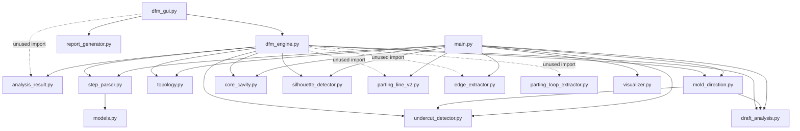

# DfM Intelligence Agent: Dependency Audit Report

This report provides a repository-wide dependency scan and module verification for the Design-for-Manufacture (DfM) project. It classifies every file as active, legacy, or experimental, and details all import relations, runtime references, and class usage.

---

## 1. Dependency Map & Module Graph

### 1.1. Import Graph Visual

### 1.2. Runtime, GUI & Reporting Dependencies
*   **Runtime CAD Kernel**: OpenCascade (via `pythonocc-core` 7.8.1). It is imported in `dfm_gui.py`, `dfm_engine.py`, `step_parser.py`, `topology.py`, `draft_analysis.py`, `undercut_detector.py`, `core_cavity.py`, `silhouette_detector.py`, `edge_extractor.py`, and `parting_loop_extractor.py`.
*   **GUI Framework**: `PyQt5` (specifically `PyQt5.QtWidgets`, `PyQt5.QtCore`, and `PyQt5.QtGui`). It drives `dfm_gui.py` and coordinates signals for file selection, view mode switches, and 3D rendering updates.
*   **Reporting Engine**: `reportlab` (specifically `platypus` flowables like `SimpleDocTemplate`, `Paragraph`, `Table`, `Spacer`, and `Image`, as well as `lib.colors`). It is used exclusively inside `report_generator.py` to compile and export professional validation PDF files.

---

## 2. Verification of Specific Imports (Used vs. Unused)

To prevent breaking active algorithms, we checked the usage of the five candidate classes using code references and AST structure traversal:

| Class Name | Source File | Status | Technical Evidence | Action |
| :--- | :--- | :---: | :--- | :--- |
| **`EdgeExtractor`** | `edge_extractor.py` | **UNUSED** | Only exists in the import block of `dfm_engine.py` (Line 11). There are no instantiations (`EdgeExtractor(...)`) or calls within any active file. (Only used in legacy `main.py` and scratch scripts). | **Remove import** from `dfm_engine.py`. Keep file in root. |
| **`PartingLoopExtractor`** | `parting_loop_extractor.py` | **UNUSED** | Only exists in the import block of `dfm_engine.py` (Line 12). There are no active code references or instantiations. | **Remove import** from `dfm_engine.py`. Keep file in root. |
| **`PartingLineV2`** | `parting_line_v2.py` | **UNUSED** | Only exists in the import block of `dfm_engine.py` (Line 10). The active engine has been upgraded to a BRep-intersection section-based parting solver at the optimal Z plane. | **Remove import** from `dfm_engine.py`. Archive `parting_line_v2.py`. |
| **`SilhouetteDetector`** | `silhouette_detector.py` | **USED** | Imported in `dfm_engine.py` (Line 9), instantiated on Line 313 as `silhouette_det = SilhouetteDetector(self.part)`, and executed on Line 314. The outputs are passed directly to `AnalysisResult` on Lines 518-519 to calculate silhouette metrics. | **Keep intact**. |
| **`AnalysisResult`** | `analysis_result.py` | **USED** | Instantiated on Line 496 of `dfm_engine.py` to wrap all calculated outputs of the analysis pipeline. It is returned to `dfm_gui.py` which dynamically accesses its properties (e.g. `result.optimal_z`, `result.moldability_score`) to populate UI elements. *Note: The explicit import in `dfm_gui.py` (Line 50) is unused since Python is dynamically typed and can be removed.* | **Keep intact**. Remove unused import line in `dfm_gui.py`. |

---

## 3. Module-by-Module Detailed Audit

Here is a file-by-file audit of all Python files currently present in the repository root:

### 3.1. [dfm_gui.py](file:///c:/Users/comps/Desktop/Design-for-Manufacture-main/dfm_gui.py)
*   **Active status**: **Active**. It is the main application entry point and Qt window wrapper.
*   **Who imports it**: None.
*   **What it imports**: `sys`, `os`, `PyQt5`, `OCC.Display.qtViewer3d`, `OCC.Core.AIS`, `OCC.Core.Quantity`, `dfm_engine`, `analysis_result` (unused), `report_generator`.
*   **GUI Connection details**: Connects `Open STEP File` button to `QFileDialog` file browser; connects `Run DfM Analysis` button to a background `QThread` parser and pipeline worker; connects tab-switched signals to change 3D rendering modes (Neutral, Draft, Mold Split, Moldability Demolding Exploded view).

### 3.2. [dfm_engine.py](file:///c:/Users/comps/Desktop/Design-for-Manufacture-main/dfm_engine.py)
*   **Active status**: **Active**. Orchestrates the 7-stage analytical pipeline.
*   **Who imports it**: `dfm_gui.py`.
*   **What it imports**: `os`, `numpy`, `step_parser`, `topology`, `mold_direction`, `draft_analysis`, `undercut_detector`, `core_cavity`, `silhouette_detector`, `parting_line_v2` (unused), `edge_extractor` (unused), `parting_loop_extractor` (unused), `analysis_result`, `OCC.Core.Bnd`, `OCC.Core.BRepBndLib`, `OCC.Core.gp`, `OCC.Core.BRepAlgoAPI`, `OCC.Core.TopExp`, `OCC.Core.TopAbs`, `OCC.Core.TopoDS`, `OCC.Core.BRep`, `OCC.Core.GProp`, `OCC.Core.BRepGProp`, `math`.

### 3.3. [step_parser.py](file:///c:/Users/comps/Desktop/Design-for-Manufacture-main/step_parser.py)
*   **Active status**: **Active**. Handles geometry parsing.
*   **Who imports it**: `dfm_engine.py`, `main.py` (legacy).
*   **What it imports**: `os`, `OCC.Core.STEPControl`, `OCC.Core.IFSelect`, `OCC.Core.BRepGProp`, `OCC.Core.GProp`, `models`.

### 3.4. [topology.py](file:///c:/Users/comps/Desktop/Design-for-Manufacture-main/topology.py)
*   **Active status**: **Active**. Extracts adjacency graphs.
*   **Who imports it**: `dfm_engine.py`, `main.py` (legacy).
*   **What it imports**: `OCC.Core.TopExp`, `OCC.Core.TopAbs`, `OCC.Core.TopoDS`.

### 3.5. [mold_direction.py](file:///c:/Users/comps/Desktop/Design-for-Manufacture-main/mold_direction.py)
*   **Active status**: **Active**. Computes primary pull vector.
*   **Who imports it**: `dfm_engine.py`, `main.py` (legacy).
*   **What it imports**: `numpy`, `undercut_detector` (unused), `draft_analysis` (imported dynamically).

### 3.6. [draft_analysis.py](file:///c:/Users/comps/Desktop/Design-for-Manufacture-main/draft_analysis.py)
*   **Active status**: **Active**. Calculates draft angles.
*   **Who imports it**: `dfm_engine.py`, `mold_direction.py`, `main.py` (legacy).
*   **What it imports**: `numpy`, `OCC.Core.BRepGProp`, `OCC.Core.GProp`.

### 3.7. [undercut_detector.py](file:///c:/Users/comps/Desktop/Design-for-Manufacture-main/undercut_detector.py)
*   **Active status**: **Active**. Identifies undercut areas.
*   **Who imports it**: `dfm_engine.py`, `mold_direction.py` (unused), `main.py` (legacy).
*   **What it imports**: `numpy`, `OCC.Core.BRepGProp`, `OCC.Core.GProp`.

### 3.8. [core_cavity.py](file:///c:/Users/comps/Desktop/Design-for-Manufacture-main/core_cavity.py)
*   **Active status**: **Active**. Classifies cavity/core halves.
*   **Who imports it**: `dfm_engine.py`, `main.py` (legacy).
*   **What it imports**: `numpy`, `OCC.Core.BRepGProp`, `OCC.Core.GProp`.

### 3.9. [silhouette_detector.py](file:///c:/Users/comps/Desktop/Design-for-Manufacture-main/silhouette_detector.py)
*   **Active status**: **Active**. Marks perpendicular normal faces.
*   **Who imports it**: `dfm_engine.py`, `main.py` (legacy).
*   **What it imports**: `numpy`, `OCC.Core.BRepGProp`, `OCC.Core.GProp`.

### 3.10. [report_generator.py](file:///c:/Users/comps/Desktop/Design-for-Manufacture-main/report_generator.py)
*   **Active status**: **Active**. Compiled PDF exporter.
*   **Who imports it**: `dfm_gui.py`.
*   **What it imports**: `os` (unused), `json`, `datetime`, `reportlab` modules.

### 3.11. [models.py](file:///c:/Users/comps/Desktop/Design-for-Manufacture-main/models.py)
*   **Active status**: **Active**. Data structures for BRep parsing.
*   **Who imports it**: `step_parser.py`.
*   **What it imports**: `dataclasses.dataclass`.

### 3.12. [analysis_result.py](file:///c:/Users/comps/Desktop/Design-for-Manufacture-main/analysis_result.py)
*   **Active status**: **Active**. Holds computed metrics.
*   **Who imports it**: `dfm_engine.py`, `dfm_gui.py` (unused).
*   **What it imports**: `typing.Tuple` (unused), `dataclasses.dataclass`.

### 3.13. [edge_extractor.py](file:///c:/Users/comps/Desktop/Design-for-Manufacture-main/edge_extractor.py)
*   **Active status**: **Inactive (Supporting)**. Supporting topological functions, not actively run in pipeline.
*   **Who imports it**: `dfm_engine.py` (unused), `main.py` (legacy).
*   **What it imports**: `OCC.Core.TopAbs`, `OCC.Core.TopExp`, `OCC.Core.TopoDS`.

### 3.14. [parting_loop_extractor.py](file:///c:/Users/comps/Desktop/Design-for-Manufacture-main/parting_loop_extractor.py)
*   **Active status**: **Inactive (Supporting)**. Supporting loop extraction functions, not actively run in pipeline.
*   **Who imports it**: `dfm_engine.py` (unused).
*   **What it imports**: `OCC.Core.TopAbs`, `OCC.Core.TopExp`, `OCC.Core.TopoDS`.

### 3.15. [main.py](file:///c:/Users/comps/Desktop/Design-for-Manufacture-main/main.py)
*   **Active status**: **Legacy**. Obsolete CLI test runner.
*   **Who imports it**: None.
*   **What it imports**: `step_parser`, `topology`, `mold_direction`, `draft_analysis`, `undercut_detector`, `core_cavity`, `edge_extractor`, `visualizer`, `silhouette_detector`, `parting_line_v2`.

### 3.16. [visualizer.py](file:///c:/Users/comps/Desktop/Design-for-Manufacture-main/visualizer.py)
*   **Active status**: **Legacy**. Obsolete visualization wrapper.
*   **Who imports it**: `main.py`.
*   **What it imports**: `OCC.Display.SimpleGui`.

### 3.17. [parting_line_v2.py](file:///c:/Users/comps/Desktop/Design-for-Manufacture-main/parting_line_v2.py)
*   **Active status**: **Legacy**. Obsolete midpoint parting heuristic.
*   **Who imports it**: `dfm_engine.py` (unused), `main.py`.
*   **What it imports**: `numpy`.
